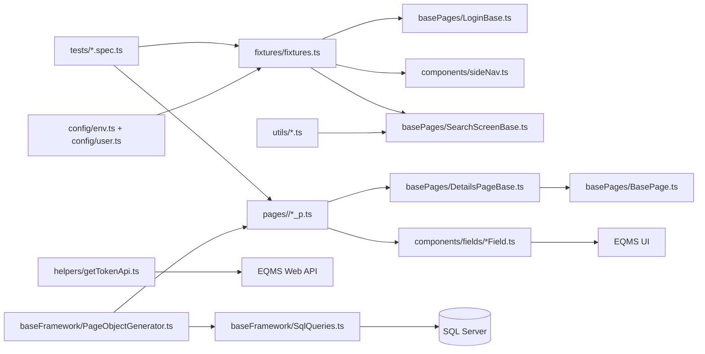
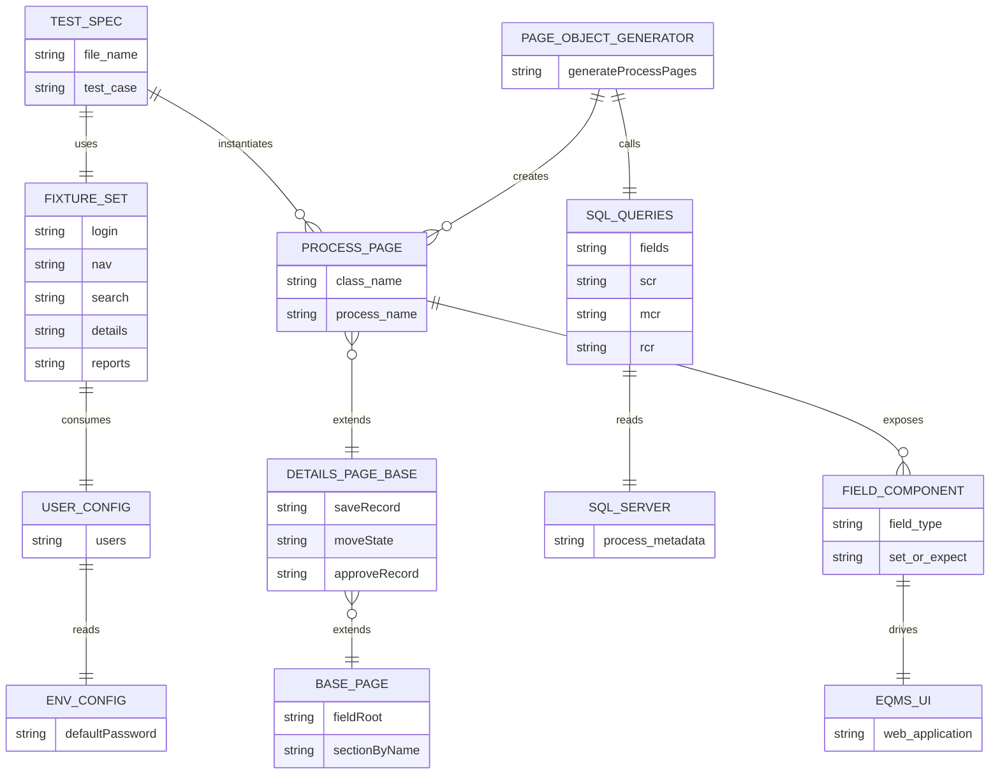

# Playwright EQMS Automation Framework

This repository is a Playwright + TypeScript test framework built around reusable base objects, field wrappers, and generated process page objects.

## Framework Structure 



## Framework Relationships



## Repository Layout

```text
.
|-- tests/                 # Test specs (UI + API focused)
|-- fixtures/              # Shared Playwright fixtures
|-- pages/                 # Generated process page objects (grouped A..W)
|-- basePages/             # Base page models (login/search/details foundations)
|-- components/            # Reusable UI components
|   `-- fields/            # Field wrappers (TextField, DateField, FileField, etc.)
|-- baseFramework/         # SQL-backed page-object generator
|-- config/                # Typed env/user configuration
|-- helpers/               # API/auth helper utilities
|-- utils/                 # Cross-cutting UI helpers
|-- data/                  # Generator/process input data
|-- testFiles/             # Upload/source files used by tests
`-- playwright.config.ts   # Playwright runtime configuration
```

## Typical Test Flow

```text
spec file
  -> fixtures provide shared objects (login/nav/search/details)
  -> test instantiates a process page object (pages/*_p.ts)
  -> page object exposes typed field wrappers
  -> wrappers interact with UI and assertions
```
